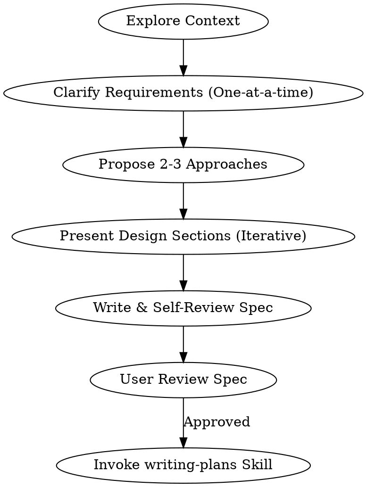

# Brainstorming Ideas Into Designs

Help turn ideas into structured, high-quality designs and specifications through focused, collaborative alignment.

<HARD-GATE>
Do NOT write code, scaffold files, or take implementation action until the design is presented and approved by the user. This applies to ALL tasks, regardless of complexity.
</HARD-GATE>

## Checklist & Workflow

You MUST execute these steps in order:

1. **Context Exploration**: Inspect existing files, docs, and git history to understand constraints and structure.
2. **Targeted Clarification**: Ask **one targeted question at a time** to clarify goals, success criteria, and constraints. Use multiple-choice options where applicable to minimize user effort.
3. **Scope Decomposition**: If the request covers multiple independent subsystems, decompose them. Brainstorm and design the first sub-project first.
4. **Architectural Trade-offs**: Propose 2-3 distinct approaches. List trade-offs and explicitly recommend one with reasoning.
5. **Iterative Specification**: Present the proposed architecture and design in logical sections (scaled to complexity). Verify correctness and get user approval for each section.
6. **Write Design Doc**: Commit the finalized specification to `docs/superpowers/specs/YYYY-MM-DD-<topic>-design.md` (or user-specified location).
7. **Spec Self-Review**: Validate the document to eliminate TODOs/Placeholders, resolve contradictions, and clarify ambiguities.
8. **User Final Review**: Ask the user to review the written spec. Refine if changes are requested.
9. **Transition**: Invoke the `writing-plans` skill to generate the implementation plan. This is the only allowed transition skill.

## Key Guidelines

- **Focus & Isolation**: Design decoupled systems with clear interfaces. Keep components small, modular, and testable.
- **Working in Existing Codebases**: Propose improvements to existing code only when they directly support the target goal. Maintain existing architectural style.
- **YAGNI**: Ruthlessly cut features that do not serve the immediate core goals.

---

### Integration Recommendation: `spec-document-reviewer-prompt.md`
**Keep `spec-document-reviewer-prompt.md` as a separate file.** 
This document acts as an external prompt template for dispatching a dedicated, objective spec-reviewer subagent. Merging it would clutter `SKILL.md` with prompt-routing templates, violating the high-density, concise design of the brainstorming skill.
