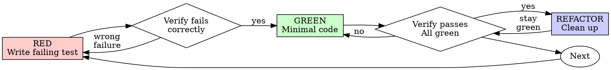

# Test-Driven Development (TDD)

Write the test first. Watch it fail. Write minimal code to pass. If you didn't watch the test fail, you don't know if it tests the right thing.

## When to Use

*Always:* New features, bug fixes, refactoring, and behavior changes. 
*Exceptions (requires partner permission):* Throwaway prototypes, generated code, and configuration files.

## The Iron Law

```
NO PRODUCTION CODE WITHOUT A FAILING TEST FIRST
```
If you wrote implementation code before the test, delete it entirely and start over. No adapting or using it as reference. Delete means delete.

## Red-Green-Refactor



### 1. RED — Write Failing Test
Write a single minimal test demonstrating the desired behavior. Avoid vague assertions or mock-dependent tests.
```typescript
test('retries failed operations 3 times', async () => {
  let attempts = 0;
  const result = await retryOperation(async () => {
    attempts++;
    if (attempts < 3) throw new Error('fail');
    return 'success';
  });
  expect(result).toBe('success');
  expect(attempts).toBe(3);
});
```

### 2. Verify RED — Watch It Fail
Run the test (=npm test path/to/test.test.ts=). You must confirm it fails for the expected reason (feature missing) and not due to typos or syntax errors. If it passes or errors, fix the test first.

### 3. GREEN — Minimal Code
Write the absolute simplest, minimal code to pass the test. Do not over-engineer or add unrelated features (YAGNI).
```typescript
async function retryOperation<T>(fn: () => Promise<T>): Promise<T> {
  for (let i = 0; i < 3; i++) {
    try { return await fn(); }
    catch (e) { if (i === 2) throw e; }
  }
  throw new Error('unreachable');
}
```

### 4. Verify GREEN — Watch It Pass
Run tests to confirm the new test passes, other tests still pass, and output is clean without console errors/warnings.

### 5. REFACTOR — Clean Up
Improve naming, remove duplication, and simplify helpers /only/ while keeping tests green. Do not add new behavior.

---

## Rationalizations & Red Flags: 5-Bullet Summary

- *The Test-After Illusion:* Writing tests after implementation is self-deception; they bias towards testing what you wrote rather than requirements, almost always pass immediately, and fail to prove they actually detect bugs.
- *The Iron Sunk-Cost Rule:* Pre-written production code is technical debt. If you wrote implementation code first, kept it as "reference", or adapted it while writing tests, you are violating TDD—stop, delete it, and start over.
- *Manual Testing Fragility:* Ad-hoc manual verification is unrepeatable, leaves no regression protection, easily misses edge cases under pressure, and provides zero systemic proof of correctness.
- *Design Defect Signals:* If a test is hard to write, requires huge mock setups, or needs highly coupled interfaces, your architecture is at fault; listen to the difficulty as a signal to simplify your design.
- *False Pragmatism:* Excuses like "too simple to test", "TDD slows me down", or "exploratory code" are rationalizations. TDD is faster than debugging, prevents regression, serves as documentation, and enables safe refactoring.

---

## Example: Bug Fix

*Bug:* Empty email accepted on form submission.

```typescript
// 1. RED
test('rejects empty email', async () => {
  const result = await submitForm({ email: '' });
  expect(result.error).toBe('Email required');
}); // Verify RED: FAIL: expected 'Email required', got undefined

// 2. GREEN
function submitForm(data: { email: string }) {
  if (!data.email?.trim()) return { error: 'Email required' };
} // Verify GREEN: PASS
```

## Verification Checklist

- [ ] Every new behavior, public interface, and bugfix has an automated test.
- [ ] Watched each test fail first for the expected reason (feature missing, not syntax errors).
- [ ] Wrote the absolute minimal code required to pass the test.
- [ ] All tests run and pass cleanly without console errors, warnings, or noise.
- [ ] Code avoids mocking unless interacting across actual system boundaries.

## When Stuck

| Problem | Solution |
| :--- | :--- |
| *Don't know how to test* | Write the desired API first, write assertions backward, or ask your human partner. |
| *Test is too complicated* | Interface or design is too complex. Redesign to simplify and decouple. |
| *Must mock everything* | Code is too coupled. Use dependency injection and real implementations. |
| *Test setup is huge* | Extract setup helpers or simplify the design. |

## Debugging Integration
When a bug is found, write a failing test that reproduces it, verify the failure, and fix it using the standard TDD cycle. Never deploy fixes without an automated test.

## Testing Anti-Patterns
Avoid mocking behavior instead of real execution, exposing test-only methods on production classes, or mocking without understanding downstream dependencies (see =@testing-anti-patterns.md=).

## Final Rule

```
Production code → test exists and failed first
Otherwise → not TDD. No exceptions.
```
